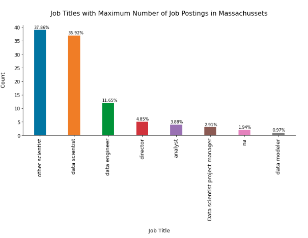

# Data Science Jobs Data Analysis
Exploratory Data Analysis of Data Science Jobs scraped from Glassdoor

by Nikhil

## Motivation

I am a Physicist who is planning to transition into the Data Science field (at the time when this was published), to make my decision crystal clear I thought it would be a great thing to go through one of the best review sites Glassdoor to see the salary of the employees, and the expectations of the company from a data science employee. The requirements put out by the company will help me understand the skills that I need to develop before I apply for a job. This was the motivation behind the projet.

This project is inspired by Ken Jee (https://github.com/PlayingNumbers).

## Table of contents:

1. Project Introduction
2. Web Scrapping
3. Data Cleaning
4. Exploratory Data Analysis
    * States
    * Industries
    * Companies
    * Job Titles

## 1. Project Introduction:
Data Science is one of the fastest growing fields in tech. It combines multiple fields, including statistics, scientific methods, artificial intelligence (AI), and data analysis, to extract values from data. In this project I scraped job postings related to Data Science field from www.glassdoor.com in U.S only. The motive was to look at different factors like job location, company revenue, company size, etc that affect the salary of jobs related top data science.

* Project Overview:
   
I scraped job postings related to Data Science field from www.glassdoor.com. This project is inspired by Ken Jee (https://github.com/PlayingNumbers). I have used a modified version of Ken Jee's selenium code because that code was not working raw for me. Selenium was used because it has small chance of getting caught by glassdoor as it mimics a human kind of interaction. Sending too many request could still increase chances of getting IP block, this limited the dataset to only 1000 jobs.

The project consists of three main notebooks:
* Glassdoor_Scrapper.ipynb: Contains the python code to scrap the data from glassdoor website.
* Glassdoor_DS_cleaning.ipynb: Clening of raw scrapped data was done in this notebook.
* Glassdoor_DS_EDA.ipynb: Exploratory data analysis on cleaned data was done in this notebook.

## 2. Web Scraping:
In this part of the project I modified Ken Jee's webscraper which scrapes data from glassdoor.com

* The most important part of web scraping is understanding the website which your are scraping and by understanding I meant looking at the source code of the website in your browser.(I didn't know anything about scrapping, It took me 1 complete day just to understand his code and then a couple od days to modify it).
* The elements scraped were Company name,Job Title,Salary,Ratings,Job Description, Industry type, Sector type etc. This information was extracted and stored in a csv format file, so I can use it directly for cleaning the data.

## 3. Data Cleaning:
The data scraped needed to be cleaned up, so that it was usable for our model.

The following changes was made:

* Basic cleanings:
   - Drop duplicates and fill NaN values.
   - Remove first column (false index) and rows without salary.
   - Reset Index
* Parsed numeric data out of salary column as min, max and avg _salary:
   - Taken into account the hourly given salaries. Changed into annual salaries
   - Added columns for employer provided salary and hourly wages. Can be used later in models.
* Parsed rating out of company text and removed undesired characters.
* Made a new column for company state and cleaned it.
* Transformed founded date into age of company
* Made columns for different skills, they were listed in the job description:
   - Python,	Spark,	AWS,	Excel,	SQL, SAS,	Julia,	Keras, MatPlotLib,	PyTorch etc.

* Column for simplified Job Title.
* Column for Seniority:
   - by Jobs Title info and by Jobs Descriptoin info.
* Cleaned other columns:
   - Size
   - Type of ownership
   - Revenue
* Made a Degree column:
   - from Job Description column
   - It accounts for any experience credit or requirement for Masters or a Ph.D. degree

Note: The cleaned dataset has been uploaded on kaggle database: https://www.kaggle.com/nikhilbhathi/data-scientist-salary-us-glassdoor

## 4. Exploratory Data Analysis:

The approach was to inspect each categorical variable and look for direct correlations with the salary distribution as well as between themself. The analysis was extensive and interesting, but it is well explained in the respective notebook. Few Highlights below:

** 100+ Insights were found from the dataset in total **
### Flow
The flow of the EDA looks like this:

### Questions:
I have tried to look into these things with great depth and good visuals:

1. States with Most Number of Jobs.
2. Average Minimal and Maximal Salaries in Different States.
3. Average Salary in Different States.
4. Top 5 Industries with Maximum Number of Data Science Related Job Postings.
5. Companies with Maximum Number of Job Openings.
6. Job Titles with Most Number of Jobs.
7. Salary of Job Titles with Most Number of Jobs.
8. Skills Required by Companies for Each Job Title.
9. Relation between Average Salary and Education.

### (A) State column:

I looked at how the jobs were distributed among different states,

Insights: 
* California has the most number of jobs.
* It is obvious for California to have most number of jobs as it is a hub for Tech. companies and has silicon valley.
* Calfornia, Massachusetts, New York, Virginia together has around 50% jobs.
* One surprising thing is, despite having the largest number of Fortune 500 companies HQ in New York, it is still on 3rd position.

After this, I also looked at the minimal and maximal annual salary (in $) in each of these states:

Insights:
* State with highest number of job, California also offers the highest average maximal annual salary, followed by Illinois.
* Both California and Illinois has almost the same average minimal annual salary.
* Pennsylvania has the lowest average minimum annual salary among the top 10 states.
* Washington has the lowest average maximum annual salary among the top 10 states.

I also looked at the average salary in different states:

Insights:
* California has the highest average annual salary, followed by Illinois. This could be beacuse there are 74 job postings in California for Data scientists which are highly paid (shown later).
* Maryland has the lowest average annual salary because it is hiring less number of people and the jobs are also distributed among high salary and low salary job titles.
* Average Salary of California is twice the average salary of Alabama, Delaware, South Carolina, Idaho, Louisiana and Nebraska.

## (B) Industries:

Next, I found the industry with maximum number of job postings related to data science.

Insights:
* Biotech & Pharmaceuticals Industry has maximum number of jobs followed by Insurance carriers.
* As a surprise, IT industry has fewer jobs for data science related roles.
* More than 65% data science related jobs lie in top 10 industries.
* For this dataset, Biotech & Pharmaceuticals Industry has twice the amount of jobs compared to IT services industry.
* It looks like Heath Care Services & Hospitals industry is hiring at a good rate because they almost surpassed the IT services industry.

I also looked at the annual minimum and maximum salary of top 5 Industries.

Insights:
* Computer Hardware & Software Industry has the highest average maximal salary among the 5 selected industries, it is followed by Biotech & Pharmaceuticals.
* Computer Hardware & Software Industry also has the highest average minimal salary among the 5 selected industries, it is followed by Biotech & Pharmaceuticals.
* Health Care Services & Hospitals industry has the lowest average maximal and minimal salary among the 5 selected industries.
* Telecommunications Manufacturing Industry has the lowest average minimum and maximum salary among all the industries.
* Financial Analytics & Research industry has the highest average minimum salary among all the industries.
* Motion Picture Production & Distribution industry has the highest average maximum salary among all the industries.
* The average maximum salary of Motion Picture Production & Distribution industry is 3.3 times of the Telecommunications Manufacturing Industry's average maximum salary.
* The average minimum salary of Financial Analytics & Research industry is 3.6 times of the Telecommunications Manufacturing Industry's average minimum salary.

## (C) Company:

Next, I looked at which company had the maximum number of job postings.

Insights:
* There are total 342 companies in the dataset. This is why there is less number of job postings by each company.
* Reynolds American, MassMutrual and Takeda Pharmaceuticals company tops the list with 14 job postings related to data science.
* In the previous plot, we also saw that a Pharmaceutical Industry was leading with the most number of job postings, we see the same trend here in this findings too. The industry also offered the highest minimum and maximum annual salary. It clearly shows that the demand of data science experts in this industry is increasing.

I also looked at the top 5 company minimal and maximal salaries in top 5 states with most number of job postings. The top 5 states with maximum job postings related to data science are: Calfornia(CA), Massachusetts(MA), New York(NY), Virginia(VA) and Illinois(IL). Plot for California below:

Insights:
- California
  * Greentech has the highest minimal and maximal annual salary among top 5 companies with highest no. of job postings. It is followed by Central California Alliance for Health.
- Massachusetts
  * Takeda Pharmaceuticals has the highest maximal annual salary. It is followed by Novaritis.
  * Kronos Bi has the highest minimal annual salary, followed by Takeda Pharmaceuticals.
- New York
  * AstraZeneca has the highest maximal annual salary. It if followed by Rochester Regional Health.
  * Swiss Re has the highest minimal annual salary, followed by AstraZeneca.
- Virginia
  * Novetta has the highest maximal and minimal annual salary.
-Illinois
  * Liberty Mutual Insurance has the highest maximal and minimal annual salary, followed by TransUnion.

I also looked at the relation between company size and average annual salary offered by the company.

Insights:
* Ofcourse, companies with the largest number of employees offers high salary. There are more than 120 such companies in the data set.
* Also, company size between 51-200 offers almost the same salary as the largest company. There are less than 120 such companies in the data set.
* Not surprisingly, companies having less than 50 employee offers the third best salary. These are usally startups. There are less number of such startups in the dataset.
* Even though companies having 501-5000 employees are most common (more than 250 companies) in the dataset but they offer the least amount of salary.

I also looked at the relation between revenue, age and salary.

Insights:
* Suprising companies having revenue between 5-10 Million pays more salary, followed by companies with revenue between 1-g Million and companies with revenue more than 10 Billion. Looking at the count plot, there are about 20 companies with revenue between 5 and 10 Million, so it can't be fake.
* Clearly, old companies are larger in size. There are around 17% companies that are older than 100 years and make revenue of $10+ billion.
* Similar thing can be seen for company size and age.

## (D) Job Titles:

Next, I looked at the most in demand job titles.

Insights:
* A large number of job postings are for Data Scientist, followed by other scientists (research scientists, consultants etc) and data engineer.
* Data scientist, data engineer and data analyst accounts for around 72% of the postings.
* Surprisingly ML engineers are in low demand. It will be interesting to see who gets paid more.

I also looked at the job titles in different states. One such example is below.

Insights:
- California
  * Almost 50% of the job postings are for Data Scientist position, followed by Data Engineer (~17%).
  * Data Scientist, Data Engineer and Data Analyst accounts for ~77% of the job postings. If we add Other Scientists job title in it, the percentage becomes more than 90%.
- Massachusetts
  * Almost 50% of the job postings are for Other Scientists (e.g. research scientists) position, followed by Data scientists (~36%).
  * Other Scientists and Data Scientists positions alone accounts for ~74% of the job postings.
- New York
  * Almost 56% of the job postings are for Data Scientist position, followed by Data Analyst (~20%).
  * Unlike California and Massachusetts, Data analyst is high in demand.
  * Data Scientists and Data Analyst accounts for 75% of the job postings in this state.
- Virginia
  * Only 4 job title postings are available in this state i.e. Data Scientist, Data Engineer, Data Analyst and ML engineer.
  * Almost 56% of the job postings are for Data Scientist position, followed by Data Engineer (~25%).
  * Data Scientists and Data Engineer accounts for ~81% of the job postings in this state.
-Illinois
  * Almost 53% of the job postings are for Data Scientist position, followed by Data Engineer (20%).
  * Data Scientists, Other Scientists and Data Engineer accounts for ~83% of the job postings in this state.

I also looked at the salary of job positions in different states. One such example is below.

Insights:
- Data Scientist
  * District of Columbia (DC) offers highest average annual salary to Data Scientist, followed by Ilinois (IL) ,California (CA). I was expecting CA on the top, mainly because California has the highest average annual salary in general (look at plot "Average salary per annum for different states").
  
- Data Engineer
  * California offers the highest salary for Data Engineer, followed by Indiana and Texas.

- Data Analyst
  * Surprisingly, Rhode Island offers the highest salary to a Data Analyst, followed by California.

- Machine Learning Engineer
  * California offers the highest salary for ML Engineer, followed by Illinois and New York.

I also verified my findings, looked at different skills required and many more things. For complete 100+ Insights, refer to the notebook.

## Built With:

Python Version: 3.8.8

Framework: Google Colab, Anaconda (Jupyter Notebook and Spyder)

Packages: pandas, numpy, matplotlib, seaborn, selenium.
